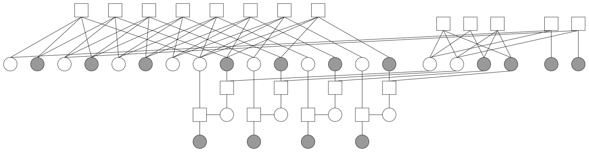

# Free-Ride coding with Enhanced & Partial structure
在 `PEGReg504x1008` PayLoad LDPC Code 上面疊加 `H_10_5` Extra LDPC Code 做傳輸。把兩個 `PCM` 合併起來形成一個新的 `PCM` 把疊加的位置給 puncture ，且在`Payload`和`Extra`新增一些連結，讓`Payload`和`Extra`不再像是兩個分開的子圖，而是整合成一個大的`Code`，大的`Code`中一部分是`Payload`/一部分是`Extra`，`Decoding`一樣是透過`BP`。

當 `iteration` 小於 `iteration_limit` 且 `PayLoad_syndrome` 非全零的時候，訊息只在`PayLoad`裡面做傳遞(不會傳送進`Extra`裡面)。

Puncture method 採用 k-SR 的概念去做 。
## 示意圖

## 檔案

- `H_combine`
    - `H_Combine.m`  : 對`Payload_PCM` 和 `Extra_PCM` 做合併的主要執行檔案，執行完後會產生 `.txt`*1、`.csv`*3 檔案
    - `Rate_Compatible_Punctured_With_Short_Block_Lengths.m` : `Puncture` 算法執行
    - `readHFromFileByLine.m` : 讀取 `PCM`檔案，僅支持讀取`regular`格式
    - `writePCM.m` : 把矩陣協成`.txt`出來
- `PCM_P1008_E10_EnhancedPartial.txt` : 合併的`PCM`檔案
- `Table_Superposition_Extra_Payload_50percent.csv` : `Puncture` 的 `VN Node(fully-combined)` (start idx = 1)
- `ExtraVNs_NewStrcuture_50percent.csv` : 新的結構中，所連接到的 `Payload bits`(`Enhanced` 結構) (start idx = 1)
- `Table_ExtraTransmitVNs_to_PuncPosPayload_50percent.csv` : `Extra VNs` 傳送出去 對應到 `Payload VNs` 做 `Puncture`
- `random_number_generator.h` : `Gaussian noise` 產生
- `UseFuction.h` : 一些有用到的 `function`
- `makefile` : 一些 `code` 執行所需要參數、讀取的一些 `file` 

## 執行程式
可以使用 `Ubuntu` 執行 `makefile`

Linux:
```
make BP
```
